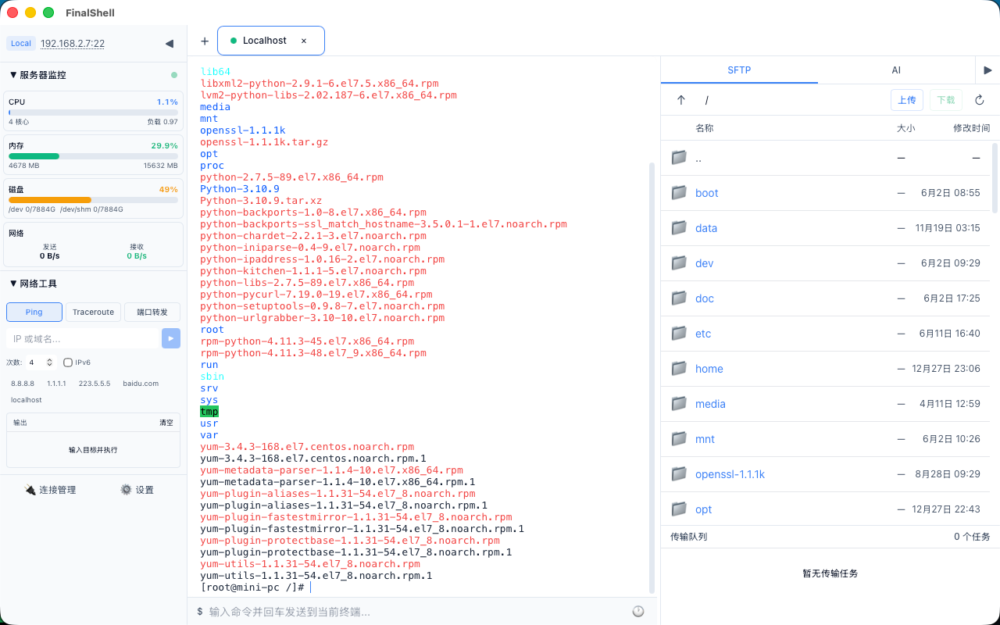
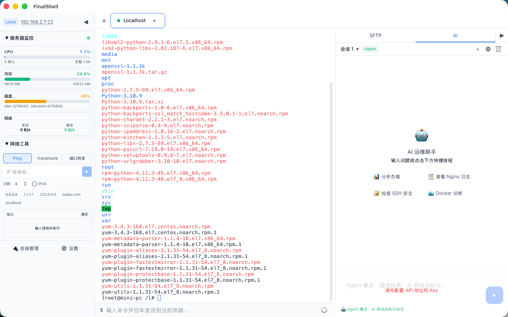
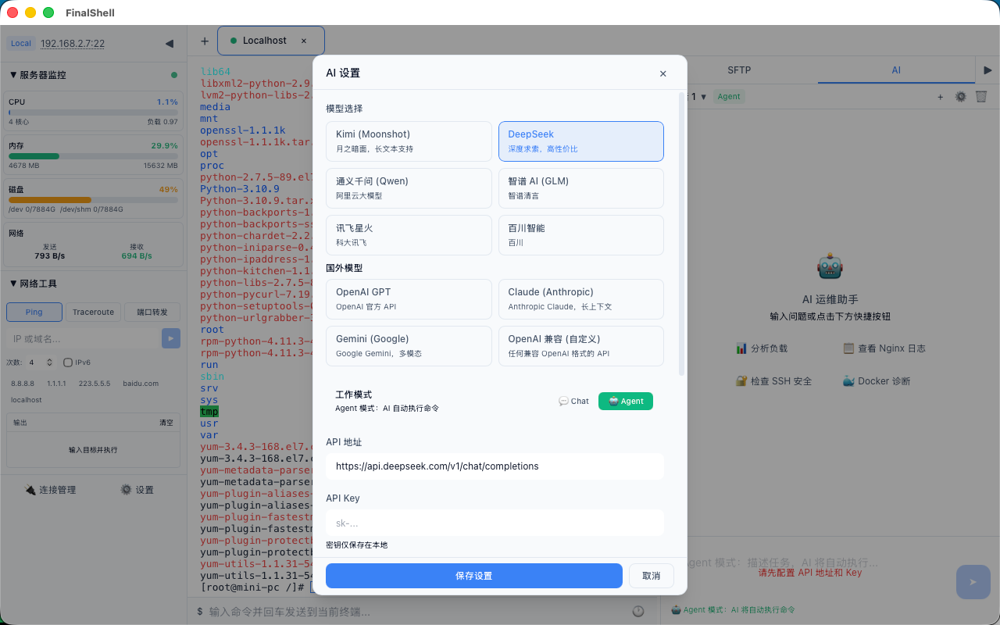
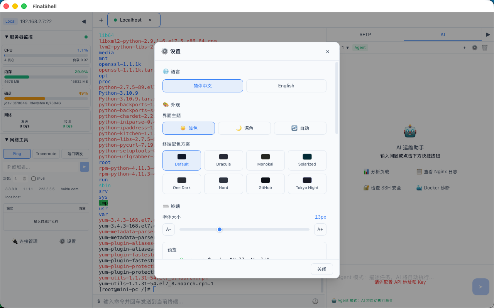
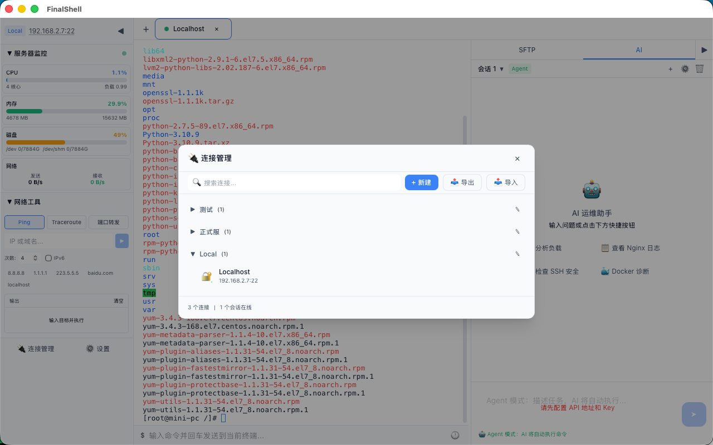

# FinalShell App

一个基于 Tauri 2 + Vue 3 的跨平台 SSH 终端管理工具。

## 功能

- SSH 终端：xterm.js 渲染，多标签，支持密码/私钥认证
- SFTP 文件管理：目录浏览、文件编辑（语法高亮）、上传下载
- 服务器监控：CPU / 内存 / 磁盘 / 网络实时监控
- AI 助手：Chat / Agent 双模式，支持自定义 API 地址和 Key
- 端口转发：本地端口转发（SSH 隧道）
- 网络工具：Ping / Traceroute 实时输出
- 系统托盘、深色/浅色主题、8 种终端配色方案

## 功能预览

### SSH 终端与 SFTP 文件管理

### AI 运维助手

支持 Chat 与 Agent 两种模式，可在终端会话中协助分析负载、查看日志、检查 SSH 安全和诊断 Docker。

### AI 模型设置

内置多家模型服务商配置，也支持接入兼容 OpenAI 格式的自定义 API。

### 个性化设置

支持简体中文和 English、浅色/深色/自动主题，以及多种终端配色和字体大小调整。

### 连接管理

集中管理 SSH 连接，支持分组、搜索、新建、导入和导出。

## 下载

请前往 [Releases](../../releases) 页面下载最新版本。

| 平台 | 安装包 |
|------|--------|
| macOS | `.dmg` |
| Windows | `.msi` / `.exe` |

## 技术栈

- 前端：Vue 3 + TypeScript + Tailwind CSS + CodeMirror 6
- 后端：Tauri 2 (Rust) + russh
- 构建：Vite

## 支持项目

如果 FinalShell App 对你有帮助，欢迎扫码打赏支持项目持续维护。

  <strong>支付宝</strong> 
  

  <strong>微信支付</strong> 
  

## 联系与交流

扫描下方二维码添加微信，或加入 FinalShell 群聊交流使用心得和问题。

  <strong>添加微信</strong> 
  

  <strong>加入群聊</strong> 
  

> 群聊二维码有有效期；如二维码已失效，请先添加微信并备注“FinalShell”。

## 许可证

MIT
